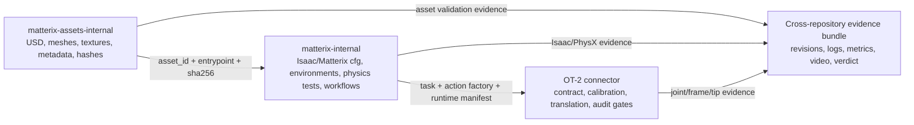

# Matterix / OT-2 Bridge Technical-Debt Register

> Status: implementation draft<br>
> Baseline date: 2026-08-19<br>
> Scope: Matterix governance, `matterix-internal`,
> `matterix-assets-internal`, and
> `opentrons-ot2-digital-twin-connector` work that directly affects the OT-2
> Bridge<br>
> Source boundary: issues exposed by the meeting, the current local checkouts,
> and official Isaac Lab release information. This document does not invent
> additional product requirements.

## 1. Executive assessment

The original 38-item list is directionally sound, and separating framework,
code, and asset debt is necessary. Five corrections are required before the
list can be executed safely:

1. **PR #50 makes Isaac Lab 3.0 the framework candidate, not an accepted Bridge
   release.** PR #50 reports a tested minimal migration to Isaac Lab 3.0 Beta
   2 Patch 1. Isaac Lab 2.3 remains a legacy reference and rollback comparator.
   Promotion still requires a machine-readable runtime fingerprint, the exact
   OT-2 smoke, and PR #51's 96-tip nested-consumer acceptance.
2. **Tests and CI exist, but the merge gate is incomplete.**
   `matterix-internal` already has tests and workflows. Before this work, its
   unit-test workflow started a container but did not run tests. The debt is
   executable test tiers and release gates, not the absence of all testing.
3. **The code repository does not currently track USD files directly.** It
   consumes an asset submodule or an external asset checkout. The action is a
   CI-enforced non-regression rule: do not copy binary assets into the parent
   code repository.
4. **Asset configuration has two owners.** USD, meshes, textures, provenance,
   hashes, and static metadata belong in `matterix-assets-internal`.
   Isaac/Matterix Python `*Cfg` objects belong in `matterix-internal`. They must
   join through `asset_id + entrypoint + sha256 + schema_version` rather than
   duplicate facts.
5. **Cross-repository acceptance requires the connector.** The asset
   repository supplies content, Matterix runs simulation and physics, and the
   connector owns joint/frame calibration, contract identity, audit, and
   fail-closed execution gates. Two locally successful Matterix PRs do not by
   themselves make the Bridge executable.

Recommended sequence:

```text
PR #50 Isaac Lab 3.0 candidate + effective CI
  -> strict compatibility evidence + nested-core gate
  -> PR #51 exact OT-2 tip-rack consumer acceptance
  -> PROMOTE / HOLD / REJECT decision
  -> exact-asset contract and physics acceptance
  -> native OT-2 workflow acceptance
  -> sim-to-real Bridge evidence
  -> release and maintenance governance
```

## 2. Evidence vocabulary

| Status | Meaning |
|---|---|
| `CONFIRMED_CHECKOUT` | Directly observed in the current local checkout |
| `REPORTED_MEETING` | Reported or observed in the meeting but not reproduced in the target runtime during this work |
| `LOCAL_TESTED` | CPU, static, schema, or unit evidence; not Isaac/PhysX end to end |
| `CI_VERIFIED` | A named remote CI run passed on the exact pushed commit |
| `SIM_RUNTIME_VERIFIED` | Executed on fixed Isaac/PhysX and asset revisions |
| `HARDWARE_VERIFIED` | Executed on a fixed physical OT-2 and calibration, with retained evidence |
| `OPEN` | Incomplete, unmerged, or not accepted at the required evidence level |

Local modifications, review worktrees, and draft PRs are reusable inputs, not
baseline capabilities. Remote branch, PR, and CI state must be refreshed before
release decisions.

Analysis snapshot:

| Repository | Branch | Base commit | Worktree at analysis time | Evidence status |
|---|---|---|---|---|
| `opentrons-ot2-digital-twin-connector` | `feat/matterix-ot2-integration-readiness` | `ad9aa53deb14` | P0 contracts and technical-debt document committed | `LOCAL_TESTED`; pushed |
| `matterix-internal` | `chore/p0-technical-debt-gates` | `7c3f404524a7` | Clean branch stacked on PR #50 | `CI_VERIFIED` |
| `matterix-assets-internal` | `chore/p0-asset-validation` | `a26eef230cff` | Clean asset-validation branch | `CI_VERIFIED` |

This table records the analysis input. It does not replace the machine-readable
cross-repository manifest.

## 3. Confirmed checkout findings

### 3.1 `matterix-internal`

- PR #50 changes the selected framework candidate to Isaac Lab `3.0.0b2` and
  records targeted Ubuntu GPU runtime evidence. The compatibility profile uses
  the upstream Beta 2 Patch 1 dependency family: Python 3.12, Isaac Sim 6.0.1,
  PyTorch 2.10, and CUDA 12.8. The exact driver remains to be captured.
- Isaac Lab 2.3 and Isaac Sim 5.1 remain documented only as the legacy runtime
  reference.
- Pre-commit and unit-test workflows exist. The previous unit-test workflow did
  not invoke pytest.
- OT-2 environments, semantics, workflows, smoke scripts, and tests exist.
  Nested-rigid and joint-alignment work is present locally or under review, so
  the remaining work is convergence, merge, and exact-runtime acceptance.
- The parent Git repository tracks no USD/USDA/USDC/USDZ files directly.
- There are no release tags. CODEOWNERS is concentrated on one owner, and there
  is no Matterix-specific contributor guide or complete architecture document.

### 3.2 `matterix-assets-internal`

- The `ot2` branch contains OT-2, pipette-tip, and tip-rack assets, Git LFS
  rules, provenance documents, and partial `usd-metadata.json` coverage.
- Directory categories mix patterns such as `labware/beaker500ml`,
  `objects/racks/tip_rack`, and `equipment/...`.
- The repository previously had no CI, contributor guide, or release tag.
- Asset repair commits are not complete physics acceptance. Collider, mass,
  gravity, origin, placement, material, alignment, and manipulation still need
  evidence on a fixed runtime.

### 3.3 `opentrons-ot2-digital-twin-connector`

- The repository contains a versioned connector contract, Bridge preflight and
  audit, Matterix action translation, joint alignment, reference-frame
  alignment, and explicit tip mapping.
- `config/matterix_ot2.json` still contains `UNVERIFIED`, `UNCONFIRMED`, and
  placeholder gates. The code is fail-closed preparation, not physical-motion
  authorization.
- The connector must consume fixed Matterix revisions and evidence. It must not
  absorb Matterix runtime or raw-asset ownership.

## 4. Repository and authority boundaries



| Scope | Owns | Does not own |
|---|---|---|
| Matterix governance | Compatibility policy, releases, DoD, PR policy, maintenance ownership | Asset physics values or OT-2 calibration |
| `matterix-internal` | Runtime integration, Python config, tasks, nested rigid, workflows, simulation tests | Raw asset source of truth or physical-motion approval |
| `matterix-assets-internal` | USD/mesh/texture, static metadata, physical/visual asset quality, LFS integrity | Base environments, state machine, or connector contract |
| OT-2 connector | OT-2/SiLA contract, sim-to-real alignment, translation, preflight, audit, fail-closed gate | Matterix core or copied raw assets |
| Cross-repository release owner | Revision manifest, acceptance matrix, release/rollback verdict | Implementation inside each repository or robot-safety authority |

### 4.1 Ownership exception

The team has not identified the accountable people. All names remain
`UNASSIGNED`. Implementation and local validation may continue, but a release
candidate, final pass report, baseline tag, or physical OT-2 run may not be
approved until the required roles are assigned.

The exact commands and decision boundary are defined in
[`MATTERIX_ACCEPTANCE_GOVERNANCE.md`](MATTERIX_ACCEPTANCE_GOVERNANCE.md).

Schema authority is split by source of truth:

- asset metadata schema: asset maintainer;
- Matterix runtime `*Cfg`: framework maintainer;
- connector evidence schema: connector maintainer;
- cross-repository manifest: release owner, with all affected consumer
  maintainers reviewing breaking changes.

## 5. Minimum issue and evidence contract

Every issue must define these fields before execution. Unknown numerical
thresholds may not be replaced with words such as "reasonable" or "obvious";
they must be frozen with units and an approver before the run.

| Field | Requirement |
|---|---|
| `status` | `OPEN / IN_PROGRESS / BLOCKED / DONE` plus an evidence level |
| `accountable / backup / assignee` | Named people, or explicit `UNASSIGNED`; one accountable role only |
| `repository / base_sha / branch` | Exact revision; dirty worktrees cannot be release inputs |
| `depends_on` | Backlog IDs and required gates |
| `inputs` | Asset ID, entrypoint, SHA-256, task, contract, calibration, and alignment IDs |
| `runtime` | OS, Isaac Lab, Isaac Sim, Python, PyTorch, CUDA, driver, and GPU |
| `command` | Reproducible non-interactive command; hardware uses a separate operator checklist |
| `sample / duration` | Fixed environment count, steps, cycles, and seed; never an unspecified `N` |
| `thresholds` | Numerical values, units, source, and approver |
| `evidence` | JSON, logs, metrics, images/video under `artifacts/matterix-acceptance/<manifest_id>/<gate_id>/` |
| `verdict / sign-off` | Target evidence level, automated verdict, maintainer sign-off, and safety approval when applicable |

## 6. Executable backlog

Unless stated otherwise, every item is `OPEN`. Local or review code becomes
`DONE` only after its DoD passes and the result is bound to a fixed manifest.

### P0: establish the baseline and merge gates

#### GOV-000: freeze the minimum governance contract

- Leave unknown human names as `UNASSIGNED`.
- Require the issue/evidence fields in Section 5.
- Define who may sign local, simulation-runtime, and hardware verdicts.
- **DoD:** the governance schema and draft manifest validate; unassigned roles
  prevent promotion but do not hide or fabricate ownership.

#### GOV-001: define the reproducible 3.0 candidate and legacy reference

- **Repository:** `matterix-internal` documentation and project governance.
- **Deliverable:** compatibility matrix for Matterix, assets, Isaac Lab, Isaac
  Sim, Python, PyTorch, CUDA/driver, and installation method.
- **DoD:** a new Ubuntu host can reproduce the PR #50 profile, produce a
  matching strict fingerprint, and run the minimum OT-2 smoke gate. The 2.3
  profile remains explicitly marked as `LEGACY_REFERENCE`.

#### INT-001: execute real CPU unit tests in CI

- **Repository:** `matterix-internal`.
- **Deliverable:** deterministic CPU test runner, JUnit artifact, timeout,
  failure exit code, and always-run container cleanup.
- **DoD:** `MATTERIX_CPU_UNIT_TESTS_PASS`; failures block the PR. This remains
  separate from the Isaac/PhysX GPU gate.

#### AST-001: add static asset CI

- **Repository:** `matterix-assets-internal`.
- **Deliverable:** Git LFS, metadata, SHA-256, and recursive metadata-entrypoint
  USD-reference validation with a JSON report.
- **DoD:** missing LFS payloads, broken local references, duplicate asset IDs,
  provenance errors, or hash drift block the PR.

#### XREPO-001: define the revision manifest and report schemas

- **Repository:** connector, consumed by all three repositories.
- **Deliverable:** machine-readable manifest and acceptance-report schemas that
  pin three commits, runtime, contracts, asset roles/hashes, evidence, and
  sign-offs.
- **DoD:** schema tests pass; the 96-tip composite is pinned separately from the
  robot articulation hash; dirty/unassigned inputs cannot be promoted.

#### GOV-006: create an accepted baseline tag

- **Depends on:** GOV-001, INT-001, AST-001, and XREPO-001.
- **DoD:** clean tags and release notes point to an exact manifest and passing
  evidence bundle; rollback has been rehearsed.

### P1: migration and framework convergence

#### GOV-002: define the upgrade policy

- Define support windows, patch/minor/major cadence, deprecation, migration
  branch, and rollback policy.
- Every Matterix release must identify the supported Isaac Lab, Isaac Sim,
  Python, and CUDA combinations and their evidence.

#### INT-002: qualify the PR #50 Isaac Lab 3.0 migration

- Keep PR #50's framework migration separate from PR #51's OT-2 consumer and
  from asset redesign.
- **DoD:** reproduce the reported GPU tests on the pushed revision, retain the
  fingerprint and smoke artifacts, record regressions and rollback, and issue
  a `GO / HOLD / NO-GO` recommendation. A `NO-GO` qualification may still be
  complete.

#### INT-003: converge nested rigid on the upstream primitive

- Use Isaac Lab `RigidObjectCollection` as the physics/state backend.
- Keep only hierarchy discovery, stable child IDs, manifest, and thin Matterix
  adaptation.
- **Core DoD:** audited fixture verifies discovery, stable IDs, independent
  pose/velocity, single-child access, and existing-asset regression.
- The exact 96-tip composite remains a later cross-repository gate.

#### INT-004: reduce base-environment blast radius

- Register new asset types through an explicit extension/interface.
- **DoD:** adding an asset type does not require unrelated manager changes, and
  existing articulation, rigid/static, and semantic tests remain green.

#### GOV-007: decide whether to promote to 3.0

- **Depends on:** GOV-002, INT-002, INT-003, INT-004, and the frozen target
  runtime regression matrix, plus PR #51 exact OT-2 tip-rack acceptance.
- **DoD:** named `PROMOTE / HOLD / REJECT` decision. Only `PROMOTE` changes the
  active baseline; other outcomes keep 2.3 as the rollback reference.

#### INT-005: create a generic asset test environment

- Parameterized empty scene, table, asset, optional robot, fixed seed, fixed
  step count, and metrics.
- One entrypoint must support load, initialize, step, force, and optional
  grasp/move/release checks.

### P2A: asset contract and physical quality

#### AST-002: unify taxonomy, naming, and metadata

- Separate category/type, manufacturer/brand, model, nominal volume, and
  variant.
- Include units, entrypoints, provenance, hash, license/redistribution state,
  and expected physics role.
- `Falcon` is a brand; `test_tube` is a type.

#### AST-003: define the asset acceptance contract

Every metadata entrypoint must verify:

- composed USD and LFS/reference completeness;
- units, up axis, default prim, origin, and initial transform;
- static/rigid/articulation role;
- collider initialization without a crash;
- mass, gravity, inertia, friction, and contact against frozen thresholds;
- material/texture and critical colors;
- fixed-step stability with no NaN, velocity-limit violation, unintended
  suspension, or penetration beyond a frozen threshold.

#### AST-004: accept the OT-2 asset family

Scope: robot, pipette, single tip, empty rack, 96-tip rack, and related labware.
Retain before/after evidence for material colors, collider, physical role,
mass/gravity, origin/placement, pipette-tip geometry, and well orientation.

#### AST-005: qualify labware and test assets

Beaker, test tube, tip rack, and meeting test assets must pass metadata,
taxonomy, static, and physical smoke gates. Movable labware needs at least one
force and one manipulation result. Test-only assets must not enter the
production catalog silently.

### P2B: OT-2 runtime, workflow, and Bridge

Implementation checkpoint (2026-08-20):

| Backlog | Implemented evidence | Remaining gate |
|---|---|---|
| INT-006 | The connector now flattens every expanded OT-2 action into one StateMachine primitive sequence and rejects empty or nested factory output. | Run the generated task extension in the pinned Isaac Lab/Matterix runtime. |
| BRG-002 | `matterix-assets-internal` now owns a content-addressed 96-well/child runtime manifest; this connector pins the corresponding normalized child-manifest hash while keeping the binding `UNVERIFIED`. | Compare the exact discovered Isaac runtime manifest with the pinned map and record the artifact. |
| INT-007 | `matterix-internal` now consumes `tip_child_id` through its nested-rigid view so only the selected child receives pose and velocity writes; CPU tests cover the addressing boundary. | Run approach, attach, lift, return, detach, settle, and 95-sibling stability checks in Isaac/PhysX. |
| XREPO-002 | `DT-Orchestrator-Bridge-PoC` now provides a shared, fail-closed acceptance profile for OT-2/Matterix and Flex/SiLA without merging their mechanics. | Supply clean revision pins and simulation/hardware artifacts; no current draft is promoted to `READY`. |
| BRG-001 | No physical measurement was added in this checkpoint. Existing joint and reference-frame placeholders still fail closed. | Collect and review X/Y/Z/A plus non-collinear world/base/deck evidence. |

#### INT-006: converge the OT-2 environment and workflow

Cover task registration, physical joints X/Y/Z/A, the B/C semantic boundary,
action factory, workflow authoring, and documented test/dev entrypoints.

#### BRG-002: freeze the tip-rack runtime manifest

Require exactly 96 child IDs, explicit well mapping, rack orientation, asset
hash, Matterix revision, and attachment contract. Never infer identity from
filename or runtime ordering.

#### INT-007: verify the native tip lifecycle

```text
approach -> contact -> attach selected child -> lift -> move
  -> return/drop -> detach -> settle -> verify final state
```

Only the selected tip may move; the other 95 remain independent. Detach must
restore physics. Cancel/failure must not leave a ghost attachment. Single- and
multi-channel capability boundaries must be explicit.

#### BRG-001: complete joint and reference-frame evidence

Collect X/Y/Z/A evidence for `q_real = sign * q_sim + offset`, confirm B/C
semantics, survey non-collinear world/base/deck fiducials, freeze residual
thresholds, and generate a review-only candidate config. Placeholders remain
fail-closed.

#### XREPO-002: run end-to-end Bridge acceptance

```text
fetch LFS -> validate hashes -> load -> initialize -> step
  -> apply force -> approach -> attach -> lift -> move
  -> return/release -> settle -> compare predicted and observed state
```

Record `LOCAL_TESTED`, `SIM_RUNTIME_VERIFIED`, and `HARDWARE_VERIFIED`
separately. Physical execution requires a pre-approved cycle count, motion
limits, stop conditions, safety owner, and operator checklist.

### P3: documentation, release, and maintenance

#### GOV-003: architecture and contributor documentation

Document module dependencies, asset/config/environment/workflow data flow,
extension points, core-file change rules, asset onboarding, testing, directory
rules, and the cross-repository release process.

#### GOV-004: complete Definition of Done

- Asset DoD: metadata + static validation + runtime physics + visual review +
  immutable hash.
- Code DoD: unit/regression + runtime smoke + documentation + compatibility
  impact.
- Bridge DoD: contract pin + simulation evidence + operator-approved hardware
  evidence, with partial levels reported honestly.

#### GOV-005: PR, release, and maintainer policy

Define single-purpose PRs, no cross-repository asset copying, review SLA,
primary/backup maintainers, semantic versioning, changelog/tag policy, support
window, deprecation, and freeze/archive behavior when ownership lapses.

## 7. Stage gates and dependencies

| Stage | Work | Exit gate |
|---|---|---|
| 0. Baseline | GOV-000, GOV-001, INT-001, AST-001, XREPO-001, GOV-006 | Named owners for promotion, strict PR #50 3.0 fingerprint, effective CI, manifest, accepted tags |
| 1. Candidate qualification | GOV-002, INT-002, INT-003, INT-004, GOV-007 | PR #50 evidence and signed promotion decision; nested core passes fixed runtime/fixture |
| 2. Asset contract | INT-005, AST-002, AST-003 | Any asset can produce a machine-readable acceptance report |
| 3. OT-2 composite | AST-004, AST-005, INT-006, BRG-002, INT-007 | Exact OT-2/tip/rack composite passes simulation runtime acceptance |
| 4. Bridge evidence | BRG-001, XREPO-002 | Joint/frame/tip evidence fixed; one operator-approved physical workflow passes |
| 5. Maintenance | GOV-003, GOV-004, GOV-005 | Documentation, ownership, release, and DoD become required process |

Critical dependencies:

| Backlog | Depends on |
|---|---|
| GOV-001, INT-001, AST-001, XREPO-001 | GOV-000 |
| GOV-006 | GOV-001, INT-001, AST-001, XREPO-001 |
| INT-002 | GOV-001, GOV-002, INT-001 |
| INT-003, INT-004 | INT-001, XREPO-001 |
| GOV-007 | GOV-002, INT-002, INT-003, INT-004, target-runtime regression matrix |
| INT-005 | INT-001, INT-004 |
| AST-003 | AST-001, AST-002, INT-005, XREPO-001 |
| AST-004, AST-005 | AST-003 |
| INT-006 | GOV-007 selected runtime, INT-004, XREPO-001 |
| BRG-001 | INT-006, XREPO-001 |
| BRG-002 | INT-003, AST-004, XREPO-001 |
| INT-007 | INT-006, BRG-002, AST-004 |
| XREPO-002 | AST-004, AST-005, INT-007, BRG-001, BRG-002 |

Work that may proceed in parallel:

- PR #50 runtime qualification may run alongside metadata/schema and
  static-validator work.
- Material, naming, and LFS/reference repairs do not need to wait for final 3.0
  promotion.
- Collider, mass, gravity, and manipulation tuning must be recorded on a fixed
  runtime and rerun on the promoted target runtime.
- Connector offline contracts/tests may continue, but physical motion remains
  fail-closed until Matterix composite and calibration evidence are complete.

## 8. Invalid completion claims

- A dummy nested fixture is not acceptance of the exact 96-tip rack.
- Opening a USD is not proof of collider, mass, gravity, or manipulation.
- A Franka tip/rack test is not OT-2 attachment or pipetting semantics.
- Unit tests are not Isaac/PhysX runtime proof.
- A plausible simulation video is not joint/frame alignment with the real OT-2.
- Code in a PR is not merged, released, or reproducible baseline capability.
- Identity placeholders or `UNVERIFIED` hashes/transforms may not authorize
  physical motion.

## 9. Traceability to the 38 meeting issues

| # | Meeting issue | Scope | Backlog |
|---:|---|---|---|
| 1 | Isaac Lab version is old | Governance / internal | GOV-001, GOV-002, INT-002, GOV-007 |
| 2 | Dependency compatibility policy is missing | Governance | GOV-001, GOV-002, GOV-007 |
| 3 | Upstream capability is reimplemented | Internal | INT-003 |
| 4 | Base-environment changes have excessive blast radius | Internal | INT-004 |
| 5 | Collider configuration lacks reliable validation | Assets + runtime | AST-003, AST-004 |
| 6 | Rigid/static, mass, and gravity behavior may be wrong | Assets + runtime | AST-003, AST-004 |
| 7 | Assets lack standardized physics acceptance | Cross-repository | INT-005, AST-003, XREPO-002 |
| 8 | OT-2 visual material is wrong | Assets | AST-004 |
| 9 | Asset placement lacks sanity checks | Assets + connector | AST-003, AST-004, BRG-001 |
| 10 | Pipette-tip insertion geometry is wrong | Assets + runtime | AST-004, INT-007 |
| 11 | Attach/detach lacks formal validation | Internal + Bridge | INT-007, BRG-002, XREPO-002 |
| 12 | Unit-test framework/coverage is incomplete | Internal | INT-001, INT-005 |
| 13 | Existing tests do not cover the target upgrade | Internal | INT-002, INT-005 |
| 14 | Continuous regression gate is missing | Internal | INT-001 |
| 15 | Assets lack a generic test fixture | Internal | INT-005 |
| 16 | Automated asset smoke is missing | Assets + internal | AST-001, AST-003, INT-005 |
| 17 | Manipulation testing is missing | Assets + runtime | AST-005, INT-007, XREPO-002 |
| 18 | Test/example/task/dev boundaries are unclear | Internal | INT-005, GOV-003 |
| 19 | Real/simulation regression is incomplete | Connector + cross-repository | BRG-001, XREPO-002 |
| 20 | Code/asset repository boundary can regress | Governance | AST-001, GOV-005 |
| 21 | Feature PR scope is too large | Governance | GOV-005 |
| 22 | Assets are copied into code for reproducibility | Governance + cross-repository | XREPO-001, GOV-005 |
| 23 | Asset directory hierarchy is undefined | Assets | AST-002 |
| 24 | Asset naming is inconsistent | Assets | AST-002 |
| 25 | Standard asset metadata is missing | Assets | AST-002, AST-003 |
| 26 | File placement rules are missing | Governance + assets | AST-002, GOV-003 |
| 27 | Release/version discipline is missing | Governance | GOV-001, GOV-002, GOV-005, GOV-006, GOV-007 |
| 28 | Overall architecture graph is missing | Governance / internal | GOV-003 |
| 29 | Module-dependency documentation is missing | Governance / internal | GOV-003 |
| 30 | Contributor guide is missing | Governance | GOV-003 |
| 31 | Asset-testing documentation is missing | Cross-repository | INT-005, AST-003, GOV-003 |
| 32 | Workflow-authoring documentation is missing | Internal | INT-006, GOV-003 |
| 33 | Knowledge depends on the original author | Governance | GOV-003, GOV-005 |
| 34 | Incomplete PRs remain unmerged | Governance | GOV-004, GOV-005 |
| 35 | Definition of Done is missing | Governance | GOV-000, GOV-004 |
| 36 | Review/task scope is not closed before new work | Governance | GOV-004, GOV-005 |
| 37 | Contributor onboarding cost is high | Governance | GOV-003, GOV-005 |
| 38 | Sustained maintainer ownership is missing | Governance | GOV-000, GOV-005 |

## 10. Current P0 implementation status

| Item | Implementation status | Current evidence |
|---|---|---|
| 1. Governance contract | Implemented with ownership exception | Roles remain `UNASSIGNED`; release promotion is blocked |
| 2. CPU unit-test CI | Implemented, pushed, and CI-verified | 58 tests passed locally and on final commit `7c3f404` in [GitHub Actions run 32291447290](https://github.com/ac-rad/Matterix-Internal/actions/runs/32291447290) |
| 3. PR #50 Isaac Lab 3.0 compatibility matrix | Implemented as framework candidate | 2.3 is a legacy reference; strict Ubuntu GPU fingerprint, OT-2 smoke, and PR #51 exact tip-rack runtime acceptance remain pending |
| 4. Manifest/report schemas | Implemented as draft | Matrix digest is pinned; release candidates re-hash fingerprint/smoke evidence and require matching content, authorized profile, clean inputs, and assigned owners |
| 5. Asset CI | Implemented, pushed, and CI-verified | 67 LFS assets, 2 metadata files, and 198 metadata-entrypoint references passed in [GitHub Actions run 32291104742](https://github.com/ac-rad/Matterix_assets_internal/actions/runs/32291104742) |

## 11. References

- [P0 acceptance governance](MATTERIX_ACCEPTANCE_GOVERNANCE.md)
- [Isaac Lab releases](https://github.com/isaac-sim/IsaacLab/releases)
- [Isaac Lab 3.0 migration guide](https://github.com/isaac-sim/IsaacLab/blob/release/3.0.0-beta2/docs/source/migration/migrating_to_isaaclab_3-0.rst)
- [Isaac Lab Beta 2 Patch 1](https://github.com/isaac-sim/IsaacLab/releases/tag/v3.0.0-beta2.patch1)
- [Matterix PR #50](https://github.com/ac-rad/Matterix-Internal/pull/50)
- [Matterix PR #51](https://github.com/ac-rad/Matterix-Internal/pull/51)
- [Connector acceptance boundary](OT2_MATTERIX_INTEGRATION.md)
- Connector port plan: `OT2_MATTERIX_PORT_PLAN.md`
- Matterix compatibility matrix: `matterix-internal/docs/compatibility_matrix.md`
- Matterix OT-2 acceptance: `matterix-internal/docs/ot2_acceptance.md`
- Matterix OT-2 reproduction: `matterix-internal/docs/ot2_reproduction.md`
- OT-2 asset metadata: `matterix-assets-internal/robots/ot2/usd-metadata.json`
- Tip-rack metadata: `matterix-assets-internal/objects/racks/tip_rack/usd-metadata.json`
