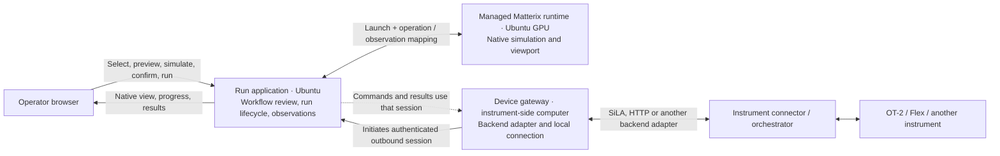

# Browser-operated Matterix and instrument application

## Product requirement

An operator uses an authenticated browser to select an instrument and workflow,
preview it, run Matterix on the Ubuntu GPU workstation, see the native Matterix
view and execution observations, and then explicitly run the device or select
paired execution. The browser computer has no instrument-control role.

Version 0.6.0 implements the managed runtime, native frame feed and outbound
gateway described below. See [the executable OT-2 test guide](src/ot2_bridge/guides/browser-ot2-test.md).
CPU/HTTP/browser fixture acceptance is separate from native GPU and physical acceptance.

## Operator flow

1. Open the application and select a registered instrument and supported workflow.
   The application displays device-gateway availability and Matterix availability.
   Connector addresses and Python paths are site setup, not per-operator inputs.
2. Preview the planned operations. Label this preview as planned, with the selected
   instrument model, labware and mapping scope.
3. Select **Simulate**. The application starts the configured native Matterix
   process on Ubuntu, loads the reviewed plan and waits for its actual readiness
   handshake. Show startup progress and actionable startup errors in the page.
4. Display the actual Matterix viewport or camera stream alongside operation
   progress and source-labelled observations. A schematic or animation is not a
   substitute for this native simulation view. A missing stream stays unavailable.
5. After reviewing the rehearsal, select **Run device**, or review a new paired
   run and select **Run both**. Bind the workflow/profile hash, the selected device
   identity and the operator's authorization to that execution. A rehearsal and a
   physical execution have distinct run IDs linked to the same reviewed workflow.
6. Show real and simulated progress and observations separately. Paired mode uses
   operation boundaries, not a promise of matching wall-clock or physical state.

Simulation completion does not authorize real motion automatically and is not
proof of physical success. Report observations the connector actually provides;
do not infer attachment, dropped tools or collisions from agreement with a model.

## Responsibility boundaries

| Component | Owns | Does not own |
|---|---|---|
| Browser | Operator interaction and presentation | Hardware connectivity or persistent execution |
| Run application | Reviewed runs, authorization, device reservation, runtime startup, reports and session routing | Physical truth or Matterix's native state |
| Thin bridge core | Operation/observation mapping, correlation, units/frames and evidence labels | Scheduling, retry, recovery, process supervision or video streaming |
| Matterix runtime | Simulation execution, native state and native visual output | Verification of unobserved real events |
| Device gateway | Authenticated outbound session and locally configured backend adapter | Workflow decisions or automatic retries of uncertain actions |
| Connector / orchestrator | Its device-control or workflow authority and actual supported observations | Browser-specific configuration |

The existing Operation, Outcome, Observation and adapter contracts remain the
integration boundary. An application may use SiLA adapters now and another
orchestrator's adapter later. Network sessions, process supervision and the viewer
belong outside the thin core.

## Deployment and connection direction

During the current test, the Mac is physically wired to the OT-2, so it is the
temporary device gateway. Its role is independent of whichever computer opens
the browser. A lab computer or suitable robot-side process can later provide the
gateway without changing the operator workflow.

The gateway initiates its session to the application endpoint and receives work
over that established session. No inbound instrument-control listener on each
operator's computer is required. The endpoint still needs the site's approved
network reachability and authentication; an outbound session is not permission
to bypass network policy.

One-time site configuration supplies the native Isaac environment, source/assets
paths, device identities and adapters. It is reasonable to install/start these
services once; a user should not copy a shell command for every simulation run.

## Execution and failure contracts

- Register gateways with distinct device credentials and known capabilities.
  Browser credentials do not serve as gateway credentials.
- Accept only reviewed operations for the registered device/profile. Never accept
  arbitrary Python, shell commands, connector URLs or module imports from the UI.
- A delivered hardware operation is never automatically replayed after disconnect,
  gateway restart or an uncertain result. Result delivery can be deduplicated.
- Disconnect during execution produces an unknown/held state. Reconnection alone
  does not make a device ready; reconcile its reported state explicitly.
- Keep progress/control independent of video backpressure. Report stale frames
  with timestamps and retain backend error details without leaking credentials.
- Preserve the current OT-2 stop limitation: its connector can queue Stop behind
  Home. A browser stop request is not an immediate physical emergency stop.

## Implementation and field acceptance

Version 0.6.0 adds the configured outbound device gateway, native process supervisor,
RGB frame feed with freshness labels, browser device selection, run restoration
and one-time site configuration. Direct legacy CLI/console operation remains
available when `--site-config` is omitted.

Gateway requests are delivered at most once by the mailbox and recorded before
local dispatch. Lost response => held/unknown, never inferred success. Physical
side attempt files prevent replay of a run ID. A local provider factory is the
extension point for another orchestrator; the hub only sees operations and
observations. One application currently reserves one run at a time.

CPU tests cover all three browser API paths through an outbound HTTP agent,
concurrent Stop, no replay, wrong identity/profile, missing responses, process
readiness/exit/timeout and native RGB encoding. Browser fixture acceptance checks
visible controls and results. These tests do not establish native Isaac/GPU or
physical performance. The first field acceptance remains native OT-2 Home and
position readback, followed by the independent physical run, then paired execution.

Nominal pipette geometry does not qualify tool alignment, collision checks or
liquid handling. Source state remains with each backend.
