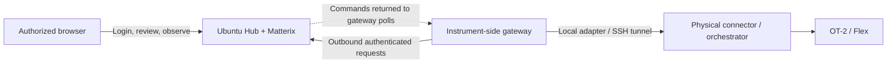

# Sim2Real 网络拓扑与部署

状态：0.7.0 实现方案（2026-10-01）。浏览器、Hub、gateway 的职责分离；当前支持显式 Tailscale IP、配置的 MagicDNS 地址、loopback HTTPS 代理和同机 gateway。CPU 验证不代表已在实验室部署，也不代表 GPU／实机验收通过。

部署命令见 [OT-2 测试指南](src/ot2_bridge/guides/browser-ot2-test.md) 和 [入口、升级与迁移指南](src/ot2_bridge/guides/deployment.md)。

## 1. 目标与边界

操作者从已获授权的电脑浏览器选择仪器和 workflow，预览、启动 Ubuntu 上的 Matterix、查看真实渲染和运行观察，然后明确授权 real 或 paired run。浏览器不需要 Python、SiLA 或 OT-2 网线。

“任何电脑”指已经获得站点网络访问及应用登录授权的电脑。按组配置访问规则，不必逐台写 ACL；新用户／节点仍须按站点流程加入网络。这个应用不修改 Tailscale 策略。

先 sim 再 real 是推荐操作顺序。站点可设置 `require_rehearsal: true`，要求 real／paired 引用同一 workflow 和 qualified profile 的成功 sim run。默认 false，允许独立实机连接测试。任何设置下都需要新的 review 和显式物理运行确认；sim 成功不证明 real 会成功。

本轮 OT-2 范围仍为 Home + position readback，不增加 tip／液体语义。

## 2. 角色和状态归属

| 角色 | 职责 | 持久状态与迁移 |
|---|---|---|
| 浏览器 | 选择、review、授权、观察 | 无执行账本；刷新重连不重放命令 |
| Hub（Ubuntu） | Run 应用、Matterix 进程、运行记录、授权、单次运行预约、会话路由 | 保存 reviewed plan、报告、事件、SQLite 下发记录、待核实状态和人工核实记录；迁移时保留整个 output 目录 |
| Gateway（仪器侧主机） | 出站会话、调用本地 backend adapter、局部互斥 | 保存凭证、命令 attempt ledger 和 run-ID 防重放记录；迁移不是无状态替换 |
| Matterix | 模拟执行、模拟状态、原生画面 | 自己的原生状态，不是物理事实 |
| Connector／orchestrator | 设备控制／工作流执行权、实际支持的观察 | 物理状态与外部工作流政策属于其自身 |
| Thin bridge core | Operation／Outcome／Observation 映射、关联、单位与证据标签 | 不接管上述运行、网络、恢复或视频职责 |

Hub 日志描述“下发了什么、收到什么”，不构成真实设备状态管理器。Gateway 的本地锁无法排斥另一台电脑上的独立控制器；现场必须保证设备只有一个获授权的控制源。

## 3. 拓扑



**形态 A：Ubuntu 与 OT-2 相邻时优先。** Hub、Matterix、gateway 是同一台 Ubuntu 上的独立进程，网线直接接 OT-2。Gateway 连接 localhost；无需为同机 gateway 新增 Tailscale 节点。

**形态 B：仪器旁有独立 gateway。** 当前可用 Mac；长期用常驻实验室主机。Gateway 主动连接 Hub，浏览器可以在其他电脑。换浏览器不改变设备连接。

## 4. 入口配置

| 入口 | 配置 | 网络策略与认证 |
|---|---|---|
| 直接访问 Hub | `--listen HUB_TAILSCALE_IP --tailscale --password-file ...` | TCP 8088；浏览器密码和 session token；来源为 Tailscale IPv4 |
| 直接 MagicDNS | 上述配置加 `--public-url http://EXACT_HUB_NAME.ts.net:8088` | 名字必须解析到该监听 IP；只接受配置的精确 Host／Origin |
| HTTPS | `--listen 127.0.0.1 --public-url https://EXACT_HUB_NAME.ts.net --trusted-proxy-loopback --password-file ...`，由 Tailscale Serve 代理 | 默认 TCP 443 对 tailnet 开放；后端 8088 只在 loopback；仍需应用登录和独立 gateway token |
| 同机 gateway | 直接 IP 模式加 `--local-gateway-port 8089` | `127.0.0.1:8089` 只接受 `/gateway/*`，不提供 UI／浏览器 API；token 必须有效 |
| HTTPS 模式下同机 gateway | 直接连 `http://127.0.0.1:8088` | 共用 loopback 后端；gateway token 仍必需 |
| Hub ↔ Matterix | 动态分配的 loopback 端口 | run/profile handshake；不对外公布固定 8765 |
| Gateway ↔ OT-2 | SSH 22，转发 `127.0.0.1:15052 → 127.0.0.1:50051` | SSH key；转发只监听 loopback，不使用 `-g` |

SiLA 在机器人上的实际监听地址由 connector 安装决定，应现场核实；SSH 转发通过机器人 loopback 访问，并不证明 connector 只监听 loopback。

HTTPS gateway 使用系统信任库验证证书与配置的域名。每次连接验证 DNS 结果在 Tailscale IPv4 范围，再连接已验证的地址；不跟随重定向，不使用 HTTP_PROXY 等环境代理。域名后缀／IP 范围校验本身不证明节点身份，仍依赖站点策略及凭证。

代理模式只信任本机代理，不接受浏览器指定的任意 forwarded origin。不要把 loopback 后端通过其他未经配置的转发器暴露出去。使用 Tailscale Serve，不使用公网 Funnel。

## 5. Tailnet 角色策略

个人浏览器电脑保留用户身份。临时充当 gateway 的个人 Mac 也保留个人身份，通过获准访问 Hub 的用户组和单独的应用 gateway token 工作。

专用 Hub／专用 gateway 可分别使用 `tag:sim-hub`、`tag:ot2-gateway`。Tag 会替换设备的用户身份，给现有 Ubuntu 打 tag 前须保留远程桌面／管理员访问权限。常驻 gateway 默认使用持久节点和单次注册 key；ephemeral 节点仅用于明确的临时安装。不要把 reusable 注册 key 分发给所有操作者。

以下只是应合并到既有策略的访问片段，不能直接覆盖共享 tailnet 的完整策略。8088 用于直接模式；HTTPS 部署将目标端口改成实际入口端口（通常 443）。同机形态 A 不需要第二条 grant。

```jsonc
{
  "groups": {
    "group:sim2real": ["operator@example.org"],
    "group:sim2real-admins": ["admin@example.org"]
  },
  "tagOwners": {
    "tag:sim-hub": ["group:sim2real-admins"],
    "tag:ot2-gateway": ["group:sim2real-admins"]
  },
  "grants": [
    {"src": ["group:sim2real"], "dst": ["tag:sim-hub"], "ip": ["tcp:8088"]},
    {"src": ["tag:ot2-gateway"], "dst": ["tag:sim-hub"], "ip": ["tcp:8088"]}
  ]
}
```

允许规则是叠加的：新增这两条不撤销既有的宽泛允许规则。管理员须检查完整 ACL／grants，并验证：授权用户／gateway 能访问、无关节点不能访问、现有管理员远程桌面仍可用。不能保证“新增两条后其他机器自动无法访问”。

Tailscale 注册 key、Tailscale 节点身份、应用 gateway token、SSH key 和浏览器密码是不同凭证。撤销注册 key 不会自动撤销已注册节点；更换应用 token 不会停止已经下发的物理动作。

参考：[Tags](https://tailscale.com/docs/features/tags)、[Auth keys](https://tailscale.com/docs/features/access-control/auth-keys)、[Grants](https://tailscale.com/docs/features/access-control/grants)、[Serve](https://tailscale.com/docs/reference/tailscale-cli/serve)。

## 6. Gateway 迁移与凭证

支持的 gateway 主机为 Ubuntu／macOS（本地排他锁使用 POSIX `fcntl`）；Windows 浏览器可使用 UI，原生 Windows gateway 尚未支持。安装从已审核的 repository checkout 或 wheel 进行；不假定包已发布到 PyPI。

1. 等待旧运行结束，现场检查设备，停止旧 gateway 与 SSH 进程；保留它的两个 ledger 目录和 Hub output。未知结果不能通过删除记录清除。
2. Hub 操作者执行 `lab-bridge-setup gateway-credential --replace --confirm-old-gateway-stopped`，指定 `device_id`、新的 `gateway_id` 和私密 token 输出文件（完整命令见部署指南）。该设备旧 token 被撤销；Hub 会检查 registry 变化并使旧会话失效。已经交给 connector 的命令不会因此取消。
3. 新 gateway 用自己的 SSH 配置建立 loopback 转发；profile 仅改变本地 host／port 时不需要修改 Hub 的 profile。
4. 用 `lab-bridge-gateway --gateway-id ... --token-file ... --profile ... --hub ...` 启动。登记时必须匹配设备 UUID、模型、校准等 qualified profile；不接受模型或物理设备悄悄替换。
5. 浏览器执行 **Check connector**。若有 hold，确认旧 gateway／原生命令结束、设备／Matterix 闲置，填写现场检查记录并点击 **Record reconciliation**；然后重新 review 新 run。该动作保存人工声明，不推断设备安全，也不把旧报告改为成功。

已有 `token_file` 配置以安装 ID `default` 兼容。第一次签发新安装凭证后使用私密 registry，内容仅含 token 摘要；浏览器和站点目录 API 不返回 token。Gateway ID 和凭证只在安装时配置。

## 7. Run 关联和 sim ↔ real 数据

- 每次执行有独立 `run_id` 和完整 `plan_sha256`。完整 plan 包含 run ID 和连接配置，因此不能跨 run 比较为相同。
- `workflow_sha256` 标识去除 run ID 后的 operation 序列；`qualified_profile_sha256` 标识去除 gateway-local host／port 后的设备、模型及标定配置。
- 浏览器 review 查找匹配的成功 sim run，明确显示它；随后的 real／paired run 将 `rehearsal_run_id` 保存到 Hub journal 和报告。服务端重新校验引用，不能用缺失、失败或不同配置的 rehearsal 通过站点 gate。
- 历史 `binding.profile_sha256` 仍是完整 profile hash，用于当前 run 的原生 handshake，不改变既有 wire contract。
- real 与 sim Observation 保留来源、单位、坐标系和 evidence。固件 mm 和原生 joint m 不直接相减为标定误差。
- 未来依据 real 数据修正 sim 时，应产生经过 review 的新 model／calibration revision。当前 OT-2／Flex 模型仍为固定支持范围，不提供自动模型修正或通用训练数据集导出。

## 8. 持久化、失败与恢复

Hub 的 `application.sqlite3` 保存运行、事件、请求 intent／response、device hold 和 reconciliation；每次向 gateway 发出请求前提交 intent。同一 output 只允许一个 Hub 进程。保存 run 文件不能代替数据库；备份／迁移时停机复制整个 output，不能恢复过时快照后直接发动作。

Gateway 在执行前写入本地 `.attempt` 文件并 fsync；另有按物理 UUID 排他的本地运行锁和 run-ID attempt 文件。两类目录都须保留，默认分别为 `~/.local/state/matterix-gateway` 和 `~/.local/state/matterix-bridge`。

Hub 重启把未完成 run／device session 转为 held，不自动重建原生进程、不重放命令、不恢复执行。浏览器刷新只重新查看同一 job。旧版 output 中只有 plan、没有完成报告的 run 也会导入为 held。待核实的物理运行需要重新连接 gateway、只读检查和人工核实；纯模拟失败可在确认原生进程闲置后核实，无需设备在线。

凭证替换、断线和 Stop 都不证明物理动作已停止。OT-2 connector 的 Stop 可能排在 Home 后；现场急停由设备流程负责。

## 9. 已实现与待现场验收

已实现：显式入口／精确 MagicDNS Host 与 Origin、HTTPS gateway、可信 loopback 代理、同机 gateway listener、安装凭证签发替换、持久 hold／人工核实、稳定 workflow/profile 关联和可选 rehearsal gate。

仍需现场验收：完整 tailnet 策略、真实 Serve 证书／代理、Ubuntu 直连 OT-2、原生 Isaac/GPU 画面和物理 Home/readback。SSH 转发目前由安装者单独管理；自动识别有线接口／管理 SSH、自动模型标定和训练集导出是后续独立工作，不在当前命令中伪装支持。

验收顺序：入口与只读身份检查 → native sim → 人工确认后的 real → paired → 无动作条件下测试 gateway 更换及 Hub 恢复。CPU fixture 仅验证软件通信和恢复逻辑。
